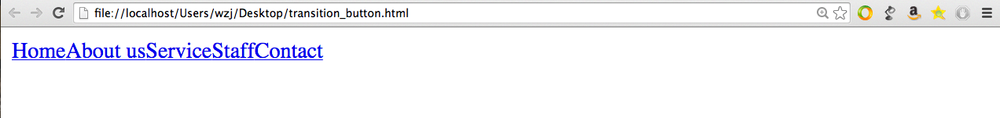
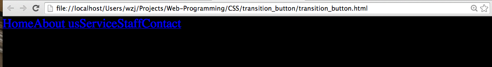
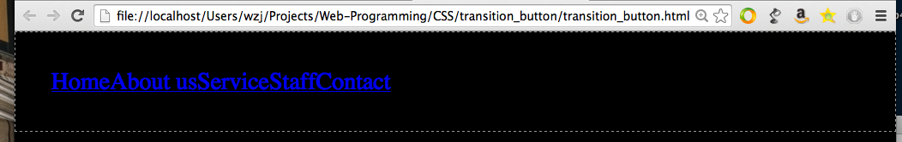
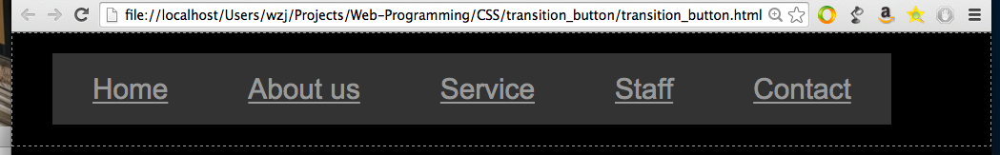
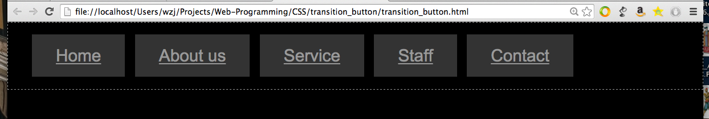
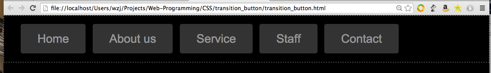
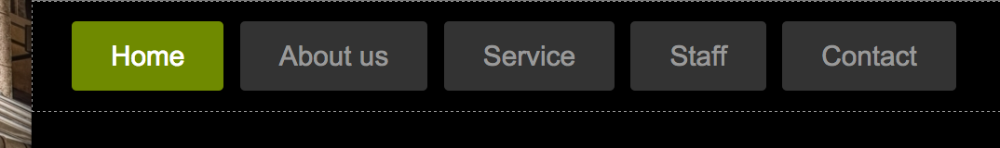

```
<!DOCTYPE html>
<html>
    <head>
    </head>

    <body>
        <div id="menubar1">
            <a href="#">Home</a><a href="#">About us</a><a href="#">Service</a><a href="#">Staff</a><a href="#">Contact</a>

        </div>
    </body>
</html>
```



----
バックグラウンドを黒にしてから、marginを０にします。

```
<html>
    <head>
    <style>
    body {
    	background: #000;
    	margin: 0;
    }
    </style>
    </head>

    <body>
        <div id="menubar1">
            <a href="#">Home</a><a href="#">About us</a><a href="#">Service</a><a href="#">Staff</a><a href="#">Contact</a>

        </div>
    </body>
</html>
```



---

id="menubar1"のdivタグにpadding 24pxをつけて、点線を表示させます。

```
<!DOCTYPE html>
<html>
    <head>
    <style>
    body {
    	background: #000;
    	margin: 0;
    }
    div#menubar1 {
    	padding: 24px;
    	border: #999 1px dashed;
    }
    </style>
    </head>

    <body>
        <div id="menubar1">
            <a href="#">Home</a><a href="#">About us</a><a href="#">Service</a><a href="#">Staff</a><a href="#">Contact</a>

        </div>
    </body>
</html>
```


---


```
<!DOCTYPE html>
<html>
    <head>
    <style>
    body {
    	background: #000;
    	margin: 0;
    }
    div#menubar1 {
    	padding: 24px;
    	border: #999 1px dashed;
    }
    div#menubar1 > a {
    	font-family: Arial, Helvetica, sans-serif;
    	font-size: 17px;
    	color: #999;
    	background: #333;
    	padding: 12px 24px;
    }
    </style>
    </head>

    <body>
        <div id="menubar1">
            <a href="#">Home</a><a href="#">About us</a><a href="#">Service</a><a href="#">Staff</a><a href="#">Contact</a>

        </div>
    </body>
</html>

```



---

margin-left属性を入れます

```
<!DOCTYPE html>
<html>
    <head>
    <style>
    body {
        background: #000;
        margin: 0;
    }
    div#menubar1 {
        padding: 24px;
        border: #999 1px dashed;
    }
    div#menubar1 > a {
        font-family: Arial, Helvetica, sans-serif;
        font-size: 17px;
        color: #999;
        background: #333;
        padding: 12px 24px;
        margin-right: 10px;

    }
    </style>
    </head>

    <body>
        <div id="menubar1">
            <a href="#">Home</a><a href="#">About us</a><a href="#">Service</a><a href="#">Staff</a><a href="#">Contact</a>

        </div>
    </body>
</html>
```



---

border-radiusとtext-decroation属性を入れます．

```
<!DOCTYPE html>
<html>
    <head>
    <style>
    body {
        background: #000;
        margin: 0;
    }
    div#menubar1 {
        padding: 24px;
        border: #999 1px dashed;
    }
    div#menubar1 > a {
        font-family: Arial, Helvetica, sans-serif;
        font-size: 17px;
        color: #999;
        background: #333;
        padding: 12px 24px;
        margin-right: 10px;
        text-decoration: none;
        border-radius: 3px;

    }
    </style>
    </head>

    <body>
        <div id="menubar1">
            <a href="#">Home</a><a href="#">About us</a><a href="#">Service</a><a href="#">Staff</a><a href="#">Contact</a>

        </div>
    </body>
</html>
```



---

div#menubar1 > a:hover　を追加します

```
<!DOCTYPE html>
<html>
    <head>
    <style>
    body {
        background: #000;
        margin: 0;
    }
    div#menubar1 {
        padding: 24px;
        border: #999 1px dashed;
    }
    div#menubar1 > a {
        font-family: Arial, Helvetica, sans-serif;
        font-size: 17px;
        color: #999;
        background: #333;
        padding: 12px 24px;
        margin-right: 10px;
        text-decoration: none;
        border-radius: 3px;

    }

    div#menubar1 > a:hover {
        background: #6F8A00;
        color: #FFF;
    }
    </style>
    </head>

    <body>
        <div id="menubar1">
            <a href="#">Home</a><a href="#">About us</a><a href="#">Service</a><a href="#">Staff</a><a href="#">Contact</a>

        </div>
    </body>
</html>
```



---

transitionを追加します.
-webkit-transitionはsafari のため追加します．

```
<!DOCTYPE html>
<html>
    <head>
    <style>
    body {
        background: #000;
        margin: 0;
    }
    div#menubar1 {
        padding: 24px;
        border: #999 1px dashed;
    }
    div#menubar1 > a {
        font-family: Arial, Helvetica, sans-serif;
        font-size: 17px;
        color: #999;
        background: #333;
        padding: 12px 24px;
        margin-right: 10px;
        text-decoration: none;
        border-radius: 3px;
        -webkit-transition: background 0.3s linear 0s, color 0.3s linear 0s;

        transition: background 0.5s linear 0s, color 0.5s linear 0s;

    }

    div#menubar1 > a:hover {
        background: #6F8A00;
        color: #FFF;
    }
    </style>
    </head>

    <body>
        <div id="menubar1">
            <a href="#">Home</a><a href="#">About us</a><a href="#">Service</a><a href="#">Staff</a><a href="#">Contact</a>

        </div>
    </body>
</html>
```

